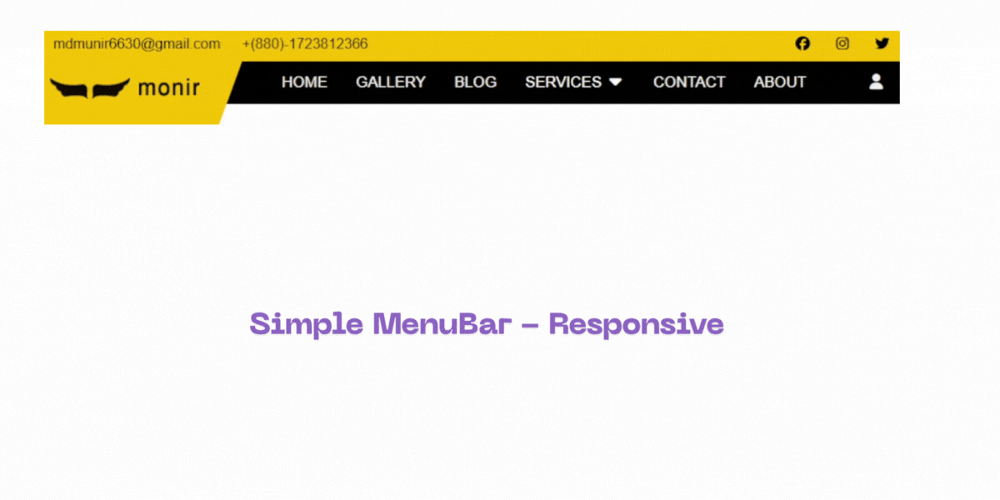

# 📝 Simple MenuBar - Responsive



## 🧭 Overview  

**Simple MenuBar - Responsive** is a clean and modern responsive navigation bar built using **HTML**, **CSS**, and **JavaScript**.  
It includes dropdown menus, smooth animations, and a fully functional hamburger menu for mobile screens.

Perfect for portfolio, business, or educational web projects.

---

## 🛠️ Tech Stack  


---

## 🚀 Features  

✅ Responsive design for all devices  
✅ Dropdown and hover animations  
✅ Smooth scrolling  
✅ Font Awesome and Bootstrap Icons support  
✅ Simple and lightweight structure  

## 📂 Folder Structure

```plaintext
html-forms-template/
│
├── index.html                   # HTML Forms Template
├── style.css                    # Custom CSS
│
└── README.md

### 1. Download as ZIP
- Go to the repository page on GitHub.  
- Click the green **Code** button → **Download ZIP**.  
- Extract the ZIP file to your preferred location on your computer.

### 2. Clone via Git (Optional)
If you have Git installed, open your terminal/command prompt and run:  
```bash
git clone https://github.com/muniralways/Simple-MenuBar---Responsive.git

```

📞 Contact

Author: Shirajam Munir
📧 Email: 

🐙 GitHub:

🌐 Portfolio: 